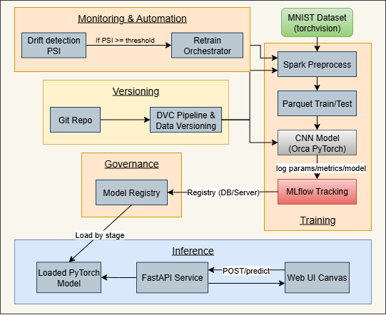
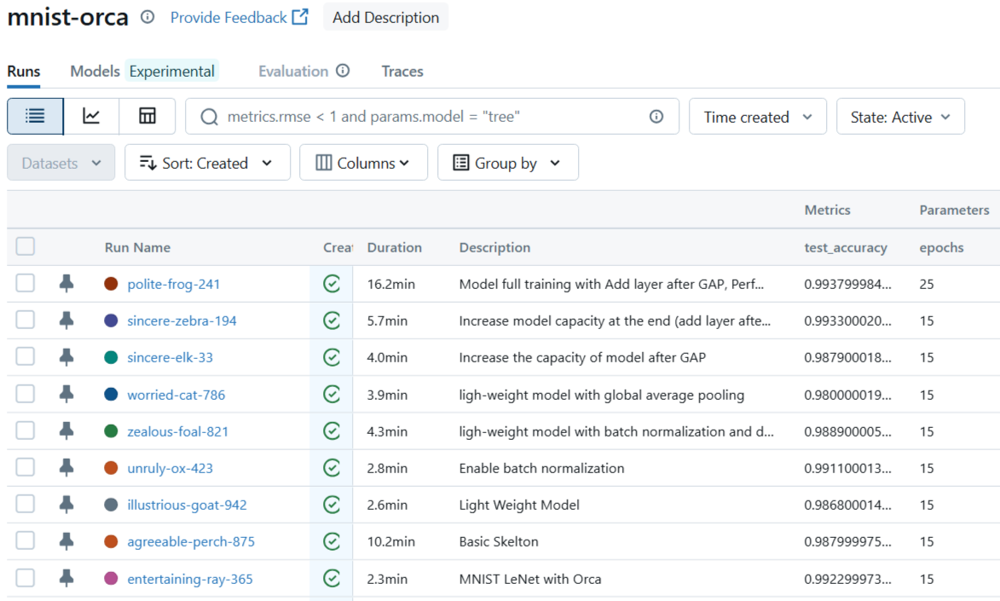
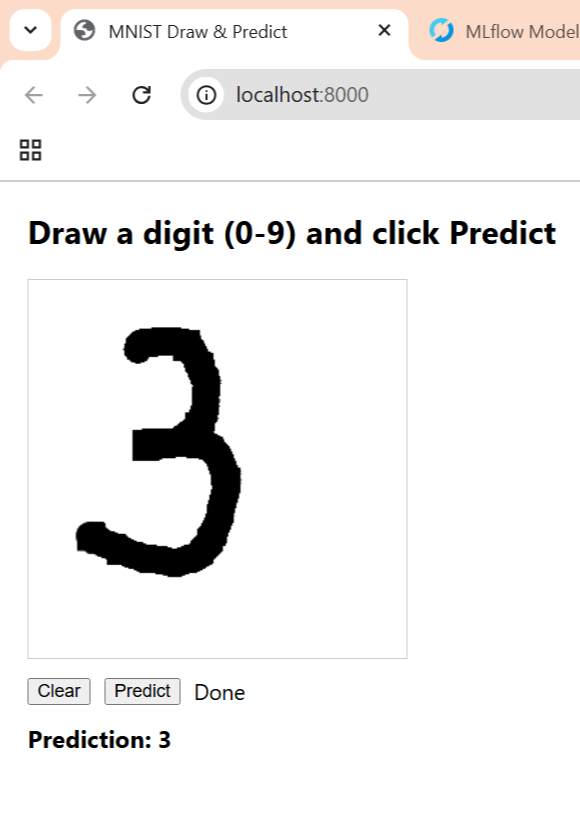
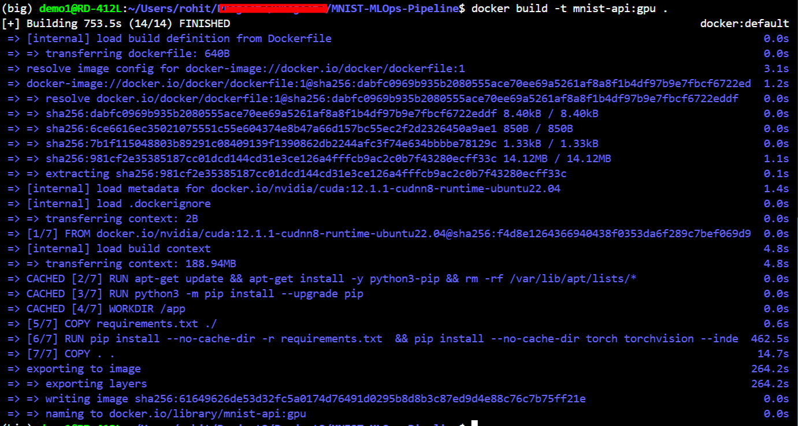
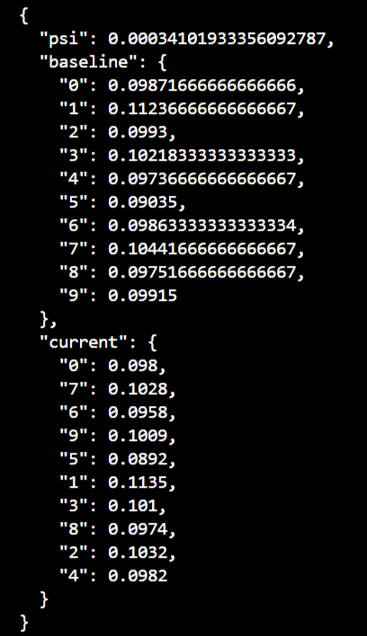

## MNIST MLOps Pipeline (BigDL-Orca + Spark + DVC + MLflow + FastAPI)

This repository implements a complete MLOps pipeline for MNIST classification using:

* Spark for scalable preprocessing
* BigDL-Orca (distributed PyTorch) for training
* MLflow for experiment tracking and model registry
* DVC for data versioning
* FastAPI for serving and a web UI for inference
* Simple drift detection + retraining workflow

---

### 🚀 Highlights

* Lightweight model (\~10k parameters) → 94% accuracy in 15 epochs
* Fully reproducible pipeline: Spark + Orca + DVC + MLflow
* Drift detection with automated retraining
* Serving via FastAPI + Web UI + Docker (GPU-ready)

*System Architecture:*



---

### Model Design

In this project, we also demonstrate step-by-step designing of a **lightweight model (\~10k parameters)** that achieves **99.33% test accuracy on MNIST within 15 epochs**.
Refer to the commit history or the project report (`docs/report.pdf`) for detailed design considerations.

| SL No | Description                                             | Duration | Params   | Accuracy | Train Loss | Test Loss |
|-------|---------------------------------------------------------|----------|----------|----------|------------|-----------|
| 1     | Core Model - LeNet                                      | 2.3 min  | 4,40,812 | 99.22    | 0.0028     | 0.0297    |
| 2     | Basic Skelton with 1/2nd of LeNet                       | 10.2 min | 1,94,884 | 98.79    | 0.0040     | 0.0379    |
| 3     | Make the model lighter with slight change in Skelton    | 2.6 min  | 10,790   | 98.68    | 0.0122     | 0.0428    |
| 4     | Add batch normalization to increase the efficiency      | 2.8 min  | 10,970   | 99.12    | 0.0098     | 0.0298    |
| 5     | Add dropout                                             | 4.3 min  | 10,970   | 98.89    | 0.0087     | 0.0388    |
| 6     | Add GAP and remove the last BIG kernel                  | 3.9 min  | 6,070    | 98.00    | 0.0438     | 0.0715    |
| 7     | Add more layers at the end                              | 4.0 min  | 11,994   | 98.79    | 0.0108     | 0.0359    |
| 8     | Perform MaxPooling at RF=5, add dropout to all layers   | 5.7 min  | 13,808   | 99.33    | 0.0092     | 0.0223    |


---

### 1) Project Structure

```text
.
├── params.yaml                      # Central configuration (data, train, mlflow, api)
├── dvc.yaml                         # DVC stage for preprocessing
├── requirements.txt                 # Python dependencies (see CUDA notes)
├── Dockerfile                       # GPU-enabled image for API serving
├── src/
│   ├── preprocess_mnist_spark.py    # Spark preprocessing → Parquet + baseline distribution
│   ├── train_mnist_orca.py          # Orca (PyTorch) training with MLflow logging/grid search
│   ├── register_model.py            # MLflow Model Registry (register + stage transitions)
│   ├── detect_drift.py              # PSI-based drift detection on label distribution
│   ├── retrain_pipeline.py          # Orchestrates preprocess → train → register
│   └── api/
│       ├── main.py                  # FastAPI service loading model from MLflow Registry
│       ├── test_api.py              # Minimal client to verify predictions
│       └── index.html               # Web UI to verify prediction
└── data/
    └── mnist/                       # Generated Parquet + baseline_distribution.json
```

---

### 2) Prerequisites

* Python 3.10 recommended
* Java (OpenJDK 11 is fine). Ubuntu:

  ```bash
  sudo apt-get install -y openjdk-11-jdk
  ```
* Internet access (to download MNIST via torchvision on first run)
* For GPU training/serving (Linux):

  * NVIDIA drivers and CUDA runtime (`nvidia-smi` must work)
  * Install CUDA-enabled PyTorch matching your CUDA version

---

### 3) Environment Setup

Create a virtual environment and install dependencies:

```bash
python3 -m venv .venv
source .venv/bin/activate
pip install --upgrade pip
pip install -r requirements.txt

# Install CUDA-enabled PyTorch (example for CUDA 12.1)
pip install torch torchvision --index-url https://download.pytorch.org/whl/cu121
```

Notes:

* `requirements.txt` intentionally does not pin CPU-only `torch/torchvision`. Install the CUDA build if using GPU.
* Do NOT set `SPARK_HOME`; Orca handles Spark packaging internally in local mode.

---

### 4) Configuration (`params.yaml`)

Key sections:

* `mnist`: output directories, normalization, train batch/epochs, search grids
* `mlflow`: experiment name, tracking URI, registered model name, registry staging
* `api`: host/port and registry stage to load (default `Production`)
* `retrain`: drift threshold and auto-retrain toggle

---

### 5) Data Preprocessing (Spark)

Generate train/test Parquet and baseline label distribution:

```bash
python src/preprocess_mnist_spark.py --params params.yaml
```

Outputs:

* `data/mnist/train.parquet`
* `data/mnist/test.parquet`
* `data/mnist/baseline_distribution.json`

With DVC (optional):

```bash
dvc init --no-scm   # if not already initialized
dvc repro           # runs the preprocess stage from dvc.yaml
```

---

### 6) Training (BigDL-Orca + PyTorch + MLflow)

Set MLflow tracking URI and run training:

```bash
export MLFLOW_TRACKING_URI="file:./mlruns"
python src/train_mnist_orca.py --params params.yaml
```

* Uses LeNet in `src/train_mnist_orca.py` with hyperparameters from CLI/params
* Auto-detects GPUs; runs on CPU if none found
* Logs parameters and per-epoch metrics (loss/accuracy) to MLflow
* Saves model artifacts; best accuracy tagged

Inspect experiments:

```bash
mlflow ui --backend-store-uri file:./mlruns --host 0.0.0.0 --port 5000
```

Open [http://127.0.0.1:5000](http://127.0.0.1:5000).

📸 *Example Screenshot – MLflow experiment dashboard:*



---

### 7) Register Best Model (MLflow Model Registry)

Registers best run’s artifacts as a model version and transitions stage:

```bash
python src/register_model.py --params params.yaml
```

* Model name: `mnist-classifier` (configurable)
* Default stage: `Staging`; can promote to `Production`
* API loads by name/stage (e.g., `models:/mnist-classifier/Production`)

---

### 8) Serving (FastAPI)

Run the API locally:

```bash
uvicorn src.api.main:app --host 0.0.0.0 --port 8000
```

Request format:

* POST `/predict`
* JSON: `{ "image": [ ... flattened or 28x28 nested floats ... ] }`

Test client:

```bash
python src/api/test_api.py --url http://127.0.0.1:8000/predict
```

Response:

```json
{ "prediction": 7 }
```

Web App: open [http://127.0.0.1:8000](http://127.0.0.1:8000).

📸 *Example Screenshot – FastAPI Web UI:*



---

### 9) Docker (GPU) for Serving

Build image:

```bash
docker build -t mnist-api:gpu .
```

Run (with NVIDIA toolkit):

```bash
docker run --rm -it --gpus all -p 8000:8000 \
  -v /absolute/path/to/mlruns:/app/mlruns \
  -e MLFLOW_TRACKING_URI=file:/app/mlruns \
  mnist-api:gpu
```

📸 *Example Screenshot – Docker container running API:*



---

### 10) Drift Detection

Detect distribution shift (PSI):

```bash
python src/detect_drift.py --params params.yaml --new-data data/mnist/test.parquet
```

Outputs PSI score, distributions, and `drift_alert.txt` if threshold exceeded.

📸 *Example Screenshot – Drift detection PSI output:*



---

### 11) Automated Retraining

Orchestrates preprocess → train → register:

```bash
python src/retrain_pipeline.py --params params.yaml
```

Can be automated via cron/systemd, triggered by drift detection.

---

### 12) Resource Optimization Tips

* Adjust `cores`, `memory`, `num_nodes` in `init_orca_context`
* GPU training → `workers_per_node` = # of GPUs
* Tune batch size / epochs for throughput
* Monitor with `nvidia-smi` and `htop`

---

### 13) Troubleshooting

* **Spark/Java errors** → Ensure Java installed, don’t set `SPARK_HOME`
* **CUDA mismatch** → Install correct PyTorch wheel (see [PyTorch site](https://pytorch.org))
* **MLflow registry issues** → Use DB backend for multi-user setups
* **Port conflicts** → Change ports in Uvicorn/MLflow
* **Slow preprocessing** → Increase `mnist.spark_partitions` in `params.yaml`
* **Windows paths** → Use raw strings or `/`; Linux recommended for GPU

---

### 14) Reproducibility & Versioning

* Data: managed via DVC (`dvc.yaml`)
* Code/configs: tracked in Git
* Keep raw data out of repo; use DVC remotes for sharing

---

### 15) Quick Commands Summary

* Preprocess → `python src/preprocess_mnist_spark.py --params params.yaml`
* Train → `export MLFLOW_TRACKING_URI="file:./mlruns" && python src/train_mnist_orca.py --params params.yaml`
* Register best → `python src/register_model.py --params params.yaml`
* Serve → `uvicorn src.api.main:app --host 0.0.0.0 --port 8000`
* Test API → `python src/api/test_api.py --url http://127.0.0.1:8000/predict`
* Drift → `python src/detect_drift.py --params params.yaml --new-data data/mnist/test.parquet`
* Retrain → `python src/retrain_pipeline.py --params params.yaml`

---
